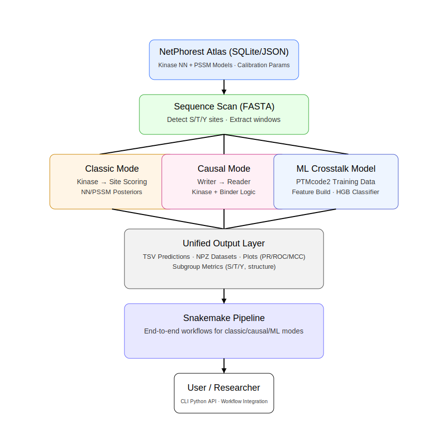

# pynetphorest

<p align="center">
  
</p>

`pynetphorest` is a **modern Python re-implementation and extension** of the NetPhorest scoring engine.

--- 

[](LICENSE)

[](https://snakemake.github.io)
 
--- 

### **Understanding the biological problem**

Kinase signalling networks control almost every decision a cell makes — growth, stress response, DNA repair, apoptosis,
migration.
These decisions are encoded in **phosphorylation events**, and each event depends on:

* which kinase recognizes a motif,
* the structural context of the site,
* and dynamic interactions between proteins (crosstalk).

Despite two decades of work, most phosphosites still lack an assigned kinase, and **crosstalk between phosphorylation
events remains even more poorly mapped**.
Experimental methods cannot scale to the millions of possible site–kinase combinations.
Bioinformatics tools filled that gap — but many legacy implementations are slow, rigid, unmaintained, and difficult to
extend to modern data.

### **Why this needed to be solved**

Researchers today work with:

* full human proteome FASTAs
* PTMcode2 co-modification networks
* deep phosphoproteomics datasets
* ML workflows and reproducible pipelines

Existing tools could not handle this scale or integrate modern ML approaches.
A modern, fast, clean, and extensible implementation was needed — something that could combine **classic motif-scoring (
NetPhorest)** with **machine-learning models for kinase–kinase crosstalk**, and run end-to-end on real datasets without
legacy constraints.

### **How pynetphorest solves it**

`pynetphorest` is a complete re-implementation of the NetPhorest/NetworKIN logic in modern Python, redesigned to be
transparent, scalable, and extendable:

* **Fast motif-scoring of S/T/Y sites** using PSSMs and NN models
* **Causal “writer→reader” mode** for binder-mediated interactions
* **ML-based crosstalk prediction** (HistGradientBoosting) trained on PTMcode2
* **Unified CLI (`app`)** for scoring, training, predicting, and evaluation
* **Snakemake pipelines** for reproducible workflows
* **Full evaluation suite**: PR/ROC, Brier, MCC, per-residue metrics, subgroup analysis
* **Threshold sweeps** for downstream filtering and biological interpretability

Everything runs on standard Python 3.10+, with no external C dependencies, and can be integrated into any proteomics or
systems-biology pipeline.

---

**Conceptual & data lineage**

This project builds on the ideas, datasets, and foundational work from:

* **PTMcode v2**
  Minguez et al. (2015) *NAR* — functional associations among PTMs within/between proteins.

* **KinomeXplorer / NetPhorest**
  Horn et al. (2014) *Nature Methods* — kinase-substrate scoring using neural networks and PSSMs.

* **Foundations of phosphorylation network discovery (NetworKIN)**
  Linding et al. (2007) *Cell* — integrated signaling logic and sequence context.

---

## Why this matters

Protein phosphorylation is one of the most information-dense regulatory systems in biology. Every signaling
decision—growth, differentiation, DNA damage response, immune activation—depends on **who phosphorylates whom**, and
what downstream binding events are enabled.
Yet, reconstructing these networks experimentally is slow, expensive, and incomplete. Tools like NetPhorest were
groundbreaking at the time, but:

* relied on **legacy C implementations**,
* were difficult to extend or integrate,
* lacked **modern ML evaluation**,
* had limited support for **crosstalk logic** (e.g., kinase → binder causal chains),
* and were not scalable for modern proteome-wide analyses.

For real biological problems—like inferring context-specific signaling rewiring, or integrating phosphoproteomics with
structural knowledge—we need a framework that is fast, transparent, scriptable, and extensible.

---

## What this project contributes

It maintains full compatibility with the original algorithmic logic , while rebuilding the neural-network and PSSM
scoring stack in pure Python for clarity and reproducibility .

It adds three key capabilities:

### **1. A clean, modular scoring engine**

* Pure-Python implementation of all NetPhorest neural networks and PSSMs
* SQLite-based atlas format (fast, portable, inspectable)
* Support for both classic and causal (writer→reader) predictions
* Thread/process-parallel execution for whole-proteome scans

### **2. A full ML pipeline for phosphorylation crosstalk**

The `crosstalk` module trains a machine-learning model on PTMcode2 co-occurrence data to predict functional PTM-PTM
edges.
It includes:

* feature construction,
* dataset assembly,
* model training,
* threshold sweeping,
* full evaluation with PR/ROC/Brier/MCC,
* per-residue and per-structure subgroup analysis.

### **3. A reproducible workflow**

A ready-to-run **Snakemake pipeline** wraps:

* classic NetPhorest scoring,
* causal extension mode,
* ML-based crosstalk training and prediction,
* evaluation and summary statistics.

All outputs are stored in a consistent, versioned directory structure.

---

## How the system works (logic flow)

1. **Load kinase models** from an SQLite atlas or JSON.
   Each model contains:

    * window size,
    * NN/PSSM architecture,
    * sigmoid calibration parameters,
    * kinase metadata.

2. **Scan sequences** for S/T/Y sites.
   For each site, the engine extracts the correct sequence window and computes raw scores → sigmoid posteriors using the
   exact mathematical logic from the original algorithms.

3. **Optional causal mode**:

    * Identify the strongest kinase ("Writer") for a site,
    * Evaluate phospho-binding domains ("Readers"),
    * Emit kinase→binder causal edges only when biological logic allows.

4. **For crosstalk**:

    * Transform PTMcode2 edges into supervised learning data,
    * Train a probabilistic classifier,
    * Export a TSV of predicted crosstalk edges,
    * Evaluate global and subgroup metrics.

The entire workflow is reproducible and analysis-ready for downstream interpretation.

---

## Who is this for?

This toolkit is written for scientists across domains:

* computational biologists needing reproducible kinase scoring
* phosphoproteomics researchers integrating multi-omic datasets
* cancer biologists examining pathway rewiring
* ML researchers building graph-based signaling models
* structural biologists studying phospho-binding domain specificity
* any researcher wanting a **transparent, modifiable, modern** NetPhorest engine

Everything runs with a single CLI:

```bash
app netphorest ...
app crosstalk ...
app evaluate ...
```

and the Snakemake pipeline ties the whole ecosystem together.

```bash 
snakemake -j 8 --config mode=netphorest  
# or 
snakemake -j 8 --config mode=crosstalk 
# or 
snakemake -j 8 --config mode=both
```

---

**Conceptual & data lineage**

This project builds on the ideas, datasets, and foundational work from:

- **PTMcode v2**
    - Minguez, P., Letunic, I., Parca, L., Garcia-Alonso, L., Dopazo, J., Huerta-Cepas, J., & Bork, P. (2015).
      *PTMcode v2: a resource for functional associations of post-translational modifications within and between
      proteins.*
      **Nucleic Acids Research**, 43(Database issue), D494–D502.
      https://doi.org/10.1093/nar/gku1081

- **KinomeXplorer / NetPhorest**
    - Horn, H., Schoof, E., Kim, J., et al. (2014).
      *KinomeXplorer: an integrated platform for kinome biology studies.*
      **Nature Methods**, 11, 603–604.
      https://doi.org/10.1038/nmeth.2968

- **Phosphorylation network discovery (NetworKIN foundations)**
    - Linding, R., Jensen, L. J., Ostheimer, G. J., van Vugt, M. A., Jørgensen, C., Miron, I. M., Diella, F., Colwill,
      K., Taylor, L., Elder, K., Metalnikov, P., Nguyen, V., Pasculescu, A., Jin, J., Park, J. G., Samson, L. D.,
      Woodgett, J. R., Russell, R. B., Bork, P., Yaffe, M. B., … Pawson, T. (2007).
      *Systematic discovery of in vivo phosphorylation networks.*
      **Cell**, 129(7), 1415–1426.
      https://doi.org/10.1016/j.cell.2007.05.052

--- 

## License

This project is licensed under the BSD-3-Clause License - see the [LICENSE](LICENSE) file for details.

--- 

## Acknowledgements

We thank the original authors of NetPhorest and PTMcode2 for their foundational work and datasets that made this project
possible.
We also acknowledge the open-source community for tools and libraries that facilitated this implementation.
Nevertheless, all code and implementations in this repository are original and developed independently.

--- 

## Contact

For questions, issues, or contributions, please open an issue.